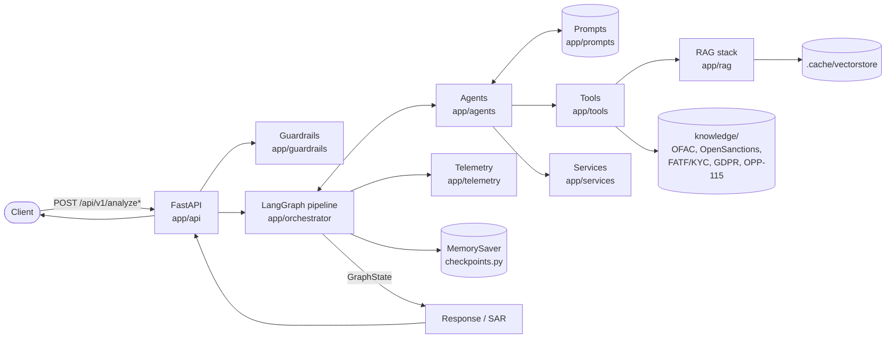
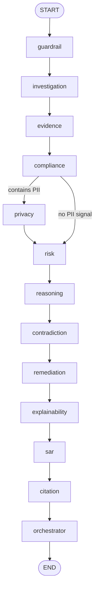

# Architecture

AI Engine is a LangGraph-based multi-agent system that investigates a
contract/SOW for AML, sanctions, GDPR and privacy risk, and produces a
grounded Suspicious Activity Report (SAR) via a FastAPI service.

## System overview



## Folder layout

```text
app/
  agents/         13 agents, one per pipeline stage (see below). Each
                  extends base_agent.py; most call an LLM using a
                  matching prompt in app/prompts/, some are pure
                  rule-based (no prompt file = no LLM call by design):
                  citation, contradiction, explainability, reasoning.
  api/            FastAPI routes, middleware (request logging),
                  dependencies (e.g. API key auth).
  config/         Settings (env-driven: LLM provider/keys, API_KEY, etc).
  exceptions/     Typed exceptions (agent, guardrail, validation) mapped
                  to HTTP responses in app/main.py.
  guardrails/     Input/output safety checks: jailbreak, prompt
                  injection, hallucination, evidence validation,
                  confidence thresholds, least-privilege tool access,
                  privacy filtering.
  models/         Pydantic domain models (contract, evidence, risk, sar,
                  request/response).
  orchestrator/   Graph wiring — the core of the system (see below).
  prompts/        One markdown prompt per LLM-backed agent.
  rag/            Retrieval stack: chunker, embeddings, reranker,
                  retriever, vectorstore (FAISS, numpy fallback).
  schemas/        API-facing schemas distinct from internal models
                  (graph_state, finding, report, evidence, api).
  services/       Business logic layer between agents/tools and
                  data/LLM (llm_service, vector_service,
                  compliance_service, risk_service, citation_service,
                  privacy_service, report_service, embedding_service).
  telemetry/      Logging, metrics, execution history, audit trail,
                  tool usage tracking, tracing.
  tools/          7 real tools that query knowledge/ via app/rag +
                  vector_service: clause_lookup, contract_search,
                  evidence_lookup, gdpr_lookup, policy_lookup,
                  regulation_lookup, vector_search. tool_permissions.py
                  is the source of truth for which agent may call which
                  tool; registry.py maps names -> callables.
  utils/          constants (incl. large-CSV scan caps), formatter
                  (to_jsonable numpy/pandas sanitizer), helpers,
                  prompt_loader.
  workflows/      Alternate, narrower graphs for cheaper/faster calls:
                  investigation-only, contract_review, privacy_review,
                  full_analysis.
  main.py         FastAPI app entrypoint, exception handlers.

knowledge/        Static reference data the tools query:
                  aml/SAML-D.csv (~1GB, 9.5M rows), sanctions/ (OFAC SDN,
                  OpenSanctions ~488MB/1.3M rows), kyc/ (FATF/KYC csvs),
                  gdpr/ (articles), privacy/ (OPP-115 annotations).
.cache/vectorstore/  Precomputed embeddings + metadata (.npy/.meta.json)
                  for gdpr_articles, regulation_reference, opp115.
```

## Orchestrator (`app/orchestrator/`)

- `state.py` — `GraphState` TypedDict shared across all nodes, plus
  `build_initial_state()` so every field has a safe default regardless
  of which agents actually run.
- `nodes.py` — `NODES` registry mapping node name -> agent `execute`
  coroutine, and `FULL_PIPELINE_ORDER`, shared by `workflow.py` and the
  alternate graphs in `app/workflows/` so there's one source of truth.
- `router.py` — conditional-edge routing functions, e.g.
  `route_privacy()` skips the privacy agent when nothing suggests PII.
- `workflow.py` — builds the `StateGraph`, wires edges in pipeline
  order, compiles with a `MemorySaver` checkpointer
  (`checkpoints.py`) — **`graph.ainvoke` requires
  `config={"configurable": {"thread_id": ...}}` or it raises.**
- `executor.py` / `events.py` / `graph_visualizer.py` — run the
  compiled graph, stream execution events, and render a mermaid diagram
  (exposed via `GET /graph`).

## Pipeline order



- **guardrail** — screens input for jailbreak/prompt-injection.
- **investigation / evidence** — summarizes the contract, extracts
  entities, cross-references sanctions & KYC data.
- **compliance / privacy** — GDPR, FATF, OFAC, OPP-115 checks; privacy
  is skipped when `route_privacy` finds no PII signal.
- **risk** — rule-based score blended with an LLM explanation.
- **reasoning / contradiction / remediation / explainability** —
  deterministic synthesis, consistency checks, remediation plan
  (no LLM calls — no matching prompt file).
- **sar** — final report, checked against evidence by the
  hallucination guardrail.
- **citation / orchestrator** — citation trail, final executive
  verdict, output-stage guardrails.

## API (`app/api/routes.py`), all under `/api/v1`

- `POST /analyze` — full pipeline.
- `POST /analyze/investigation` — investigation + evidence only.
- `POST /analyze/contract-review` — investigation + compliance + privacy.
- `POST /analyze/privacy-review` — investigation + privacy only.
- `GET /history` / `GET /history/{request_id}` — past executions.
- `GET /graph` — mermaid diagram of the full pipeline.
- `GET /metrics` — in-process timing/counters.

Set `API_KEY` in `.env` to require an `X-API-Key` header.

## Notable constraints

- `knowledge/aml/SAML-D.csv` and `knowledge/sanctions/opensanctions_targets.csv`
  are too large to load eagerly; tools scan them in bounded chunks
  (`MAX_SCAN_CHUNKS`, `CSV_CHUNK_SIZE`) or capped rows
  (`MAX_SANCTIONS_ROWS`) — see `app/utils/constants.py`.
- `app/utils/formatter.py:to_jsonable()` sanitizes numpy/pandas scalar
  types (int64/float64/NaN) before any API response, since tool
  lookups return raw `.to_dict()` rows from pandas.
- `.env` has no LLM API key configured by default — fill in
  `GROQ_API_KEY` or `GOOGLE_API_KEY` (see `.env.example`) for live
  LLM-backed agents to run; without one, only monkeypatched/mocked
  runs work.
